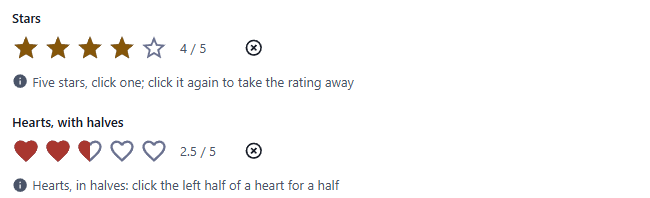
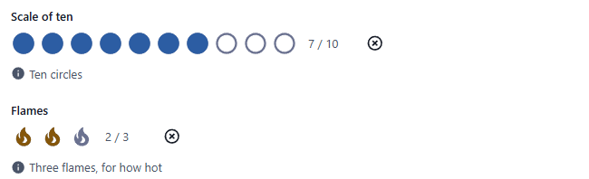
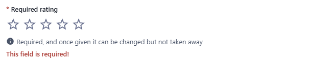
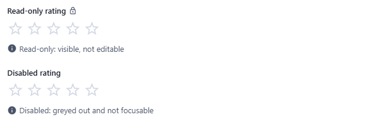

← [Field types](../FIELDS.md) · [Documentation](../../README.md)

# rating

A number of icons filled up to a value: stars, hearts, thumbs, flames, bolts or circles. Click an icon, or use the arrow keys. Component: `RatingField` (`src/components/fields/RatingField.vue`), the choices and arithmetic are in `src/utils/rating.js`.

Catalogue: `resources/numbers_quantities.js` (group **Numbers**, resource **Quantities**), fields `stars`, `hearts`, `scale`, `flames`, `requiredRating`, `localisedRating`, `readOnlyRating`, `disabledRating`.

## Declaration

```js
{ field: 'quality', input: 'rating', label: 'Quality', localised: false, options: { max: 5, icon: 'heart', half: true } }
```

## Options

| Option | Type | Default | Description |
|---|---|---|---|
| `field`, `input`, `label`, `localised` | | | As for [string](string.md). |
| `required` | boolean | `false` | Adds `*` to the label; a save without a rating is refused (`This field is required!`). |
| `options.max` | number | `5` | How many icons, from 1 to 10 (a number outside that, or that is not one, gives 5, and more than 10 gives 10). |
| `options.icon` | `'star'` \| `'heart'` \| `'thumb'` \| `'flame'` \| `'bolt'` \| `'circle'` | `'star'` | What the rating is made of. An unknown name gives stars. |
| `options.color` | `'primary'` \| `'info'` \| `'success'` \| `'warning'` \| `'error'` | by icon | The colour of the filled icons, from the theme: amber for stars and flames, red for hearts, the primary colour for the others. |
| `options.half` | boolean | `false` | Half steps: each icon has two buttons, the left half is worth a half. A value in between is rounded to the nearest half. |
| `options.clearable` | boolean | `true` | Clicking the chosen icon again, the button at the right of the icons, or Delete takes the rating away. With `false` a rating can be changed but not removed. |
| `options.hint` | string | none | Help text under the icons. |
| `options.readonly` | boolean | `false` | Shows the rating and changes nothing, with the lock icon after the label. |
| `options.disabled` | boolean | `false` | Greyed out and not focusable. |

## The widget

- A click on an icon gives that rating, and the icons under the pointer are previewed before the click.
- It is a group of radio buttons, one for each value, named by the label and "3 of 5": a screen reader says what each one is, and one of them is in the tab order. The arrow keys move by a step and write it, Home and End go to the ends, Delete and Backspace take the rating away.
- The value is shown as text next to the icons (`3.5 / 5`).

## Variations

### Default and half steps

`resources/numbers_quantities.js`, fields `stars` and `hearts` (`half: true`). The text after the icons says the value (`4 / 5`, `2.5 / 5`), and the cross takes the rating away.



### Another scale, another icon

Fields `scale` (`max: 10`, `icon: 'circle'`, `color: 'info'`) and `flames` (`max: 3`, `icon: 'flame'`).



### Required

Field `requiredRating`: an empty rating is refused when the record is saved, and once it is given it can be changed but not taken away (`clearable: false`).



### Read-only and disabled

Fields `readOnlyRating` (lock icon after the label) and `disabledRating` (greyed out, not focusable).



## Stored value

A number: a whole number from 1 to `max`, or with `half: true` a multiple of 0.5 from 0.5. Without a rating the key is absent (a rating of 0 does not exist). A localised field holds one per locale.

```json
{ "stars": 4, "hearts": 3.5, "localisedRating": { "enUS": 5, "zhCN": 4 } }
```

## Validation and behaviour

- UI: `required` refuses the save until there is a rating. A value that is not a rating (more than `max`, a text, a half without `half`) is refused with `A rating from 1 to <max>`.
- Server: only `unique`, as for any field; nothing is checked of the number.
- In the table the rating is one column, the icon of the field and `4 / 5`, sorted as a number.
