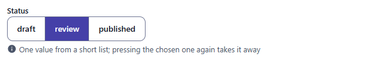
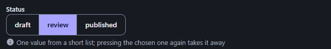
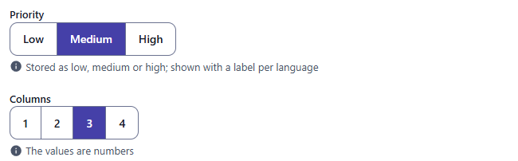
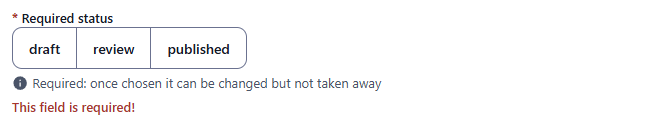
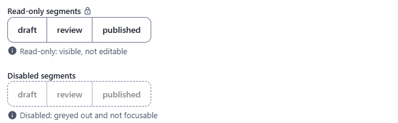

← [Field types](../FIELDS.md) · [Documentation](../../README.md)

# segmented

One value chosen from a short list, shown as a row of joined buttons with the chosen one filled. Every choice is in view and a choice is one click, where a [select](select.md) is two. Component: `ChoiceField` (`src/components/fields/ChoiceField.vue`, which also draws [radio](radio.md)); the choices and the rules are in `src/utils/choice.js`.

Catalogue: `resources/choice_buttons.js` (group **Choice**, resource **Radios and segments**), fields `status`, `requiredStatus`, `priority`, `columns`, `localisedAlign`, `fixedSize`, `readOnlySegment`, `disabledSegment`.

Use it for two to five short choices (a status, a visibility, a size, an alignment). For a long list, or for choices that are records of another resource, use a [select](select.md).

## Declaration

```js
{ field: 'status', input: 'segmented', label: 'Status', localised: false, source: ['draft', 'review', 'published'] }
```

## Options

| Option | Type | Default | Description |
|---|---|---|---|
| `field`, `input`, `label`, `localised`, `unique` | | | As for [string](string.md). A `localised` field holds one choice per locale. |
| `source` | `Array<string \| number \| { value, text }>` | none (no choices) | The values, in the order of the buttons. A number stays a number in the record. A value that is listed twice is listed once. `source` sits next to `input`, not inside `options`, as for [select](select.md); it is a list of values only, not the name of a resource. |
| `required` | boolean | `false` | Adds `*` to the label; a save with no choice is refused (`This field is required!`). Once a choice is made it can be changed but not taken away. |
| `options.labels` | `{ value: string \| { enUS, zhCN } }` | the value | What a button says. A plain string is used for every language; an object gives one text per language (the first one when the language has none). The stored value does not change. |
| `options.clearable` | boolean | `true` | Pressing the chosen button again, or Delete or Backspace on it, takes the choice away. With `false` a choice can be changed but not taken away; a required field is never clearable. |
| `options.descriptions` | `{ value: string \| { enUS, zhCN } }` | none | A line of help for a choice, shown when the pointer rests on its button (and under the label for [radio](radio.md)). |
| `options.hint` | string | none | Help text under the buttons. |
| `options.readonly` | boolean | `false` | Shows the choice, changes nothing, with the lock icon after the label. |
| `options.disabled` | boolean | `false` | Greyed out with a dashed border, and not focusable. |

## The widget

- A click on a button chooses it; a click on the chosen one takes the choice away (unless the field is required or `clearable: false`).
- It is a group of native radio buttons, so the browser gives the keyboard and the screen reader what they expect: one tab stop for the group, the arrow keys move the choice and write it, a screen reader reads "Review, radio button, 2 of 3". Delete and Backspace take the choice away.
- A record that holds a value that is not one of the choices has none pressed; the save is refused with `"gone" is not one of the choices` until another is chosen.
- The buttons stay in one row, which scrolls sideways in a narrow box.

## Variations

### Default

`resources/choice_buttons.js`, field `status`.



In the dark theme:



### Labels and numbers

Field `priority` (`options.labels`, a text per language) and field `columns` (`source: [1, 2, 3, 4]`: the record holds `3`, a number).



### Required

Field `requiredStatus`: an empty field is refused when the record is saved, and once chosen it cannot be taken away.



### Choice that stays, one per locale

Field `fixedSize` (`clearable: false`) and field `localisedAlign` (one choice for each locale).

### Read-only and disabled

Fields `readOnlySegment` and `disabledSegment`.



## Stored value

The value of the chosen entry of `source`, as it is written there (a string or a number); the key is absent when none is chosen.

```json
{ "status": "review", "columns": 3 }
```

## Validation and behaviour

- UI: `required`, and a value that is one of the choices.
- Server: only `unique`, as for any field; the value is not checked against the list.
- In the table the choice is shown with its label (in the language of the admin), and sorted by it. An xlsx export writes the value.
