← [Field types](../FIELDS.md) · [Documentation](../../README.md)

# select

Drop-down to pick **one** value from a list. The list is a static array, a static array with readable labels, or the records of another resource. Component: `CustomMultiSelect` (`src/components/fields/CustomMultiSelect.vue`, a Vuetify autocomplete, so the list can be filtered by typing).

Catalogue: `resources/choice_select.js` (group **Choice**, resource **Selects**). The resource-backed examples need records in `resources/reference_items.js` (**Reference items**, group **Reference data**).

## Declaration

```js
{ field: 'status', input: 'select', label: 'Status', localised: false, source: ['draft', 'published', 'archived'] }
{ field: 'item', input: 'select', label: 'Linked item', localised: false, source: 'reference_items', options: { customLabel: '{{name}}' } }
```

## Options

| Option | Type | Default | Description |
|---|---|---|---|
| `field`, `input`, `label`, `localised`, `unique` | | | As for [string](string.md). |
| `source` | `string[]` \| `number[]` \| resource name | none (empty list) | The values. An array is used as is; a string is the name of another resource whose records are the choices. `source` is a field key, not an option: it sits next to `input`, not inside `options`. |
| `sources` | array of resource names, or `{ resource, customLabel, title }` | none | Records of **several** resources in one list, in groups, one for each resource in the order you list them (see below). Instead of `source`, next to `input`: `sources: ['authors', { resource: 'editors', customLabel: '{{name}} ({{role}})', title: 'Editors' }]`. `customLabel` names a record of that resource (a Mustache template, in the language of the record); `title` is what the group is called (translatable), by default the name of the resource in the admin. A name that is not a resource is left out. |
| `required` | boolean | `false` | Empty selection shows `This field is required!`. In a localised field every locale must be filled. |
| `options.labels` | `{ value: string \| { enUS, zhCN } }` | none | Readable label per static value. A plain string is used for every locale; an object gives one label per locale (falls back to its first entry). Only applied to static values. |
| `options.customLabel` | Mustache template | first field of the target resource | Label of a record of a resource `source`, e.g. `'{{name}}'`. For a localised target field the current locale is used (`{{name}}` becomes `name.enUS`). Without it the first field of the target resource is displayed. |
| `options.extraSources` | `{ key: resourceName }` | none | Replaces the id stored in `key` of each target record by the related record before labels are rendered. |
| `options.subtitle` | Mustache template | the record id, for a resource `source` | Second line under each choice in the open list, rendered over the option, e.g. `'{{code}}'`. |
| `options.groupBy` | field name | none | Groups the choices of a resource `source` under headings taken from that field of each record. |
| `options.hint` | string | none | Help text under the field. |
| `options.readonly` | boolean | `false` | The list does not open; a lock icon after the label. |
| `options.disabled` | boolean | `false` | Greyed out with a dashed border. |

The placeholder is the field label. A field that is not `required` (and not read-only or disabled) has a clear button that empties it; a required one has none, so pick another value to change it.

## Variations

### Static list

`resources/choice_select.js`, fields `status` and `requiredStatus`.

```js
{ field: 'status', input: 'select', label: 'Status', localised: false, source: ['draft', 'published', 'archived'] }
```

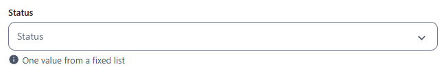 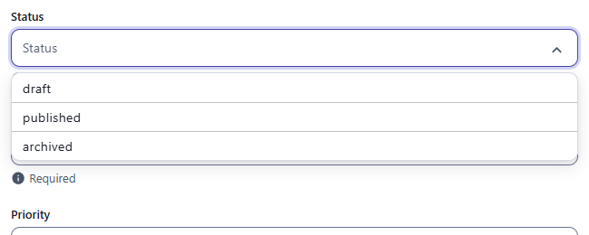

### Required

`resources/choice_select.js`, field `requiredStatus`.

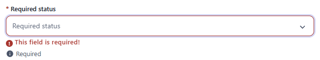

### Static values with readable labels

`resources/choice_select.js`, field `priority`. The stored value stays `low`, `medium` or `high`; the list and the chip show the label of the current locale (`High` in enUS, `高` in zhCN).

```js
options: { labels: { low: { enUS: 'Low', zhCN: '低' }, medium: { enUS: 'Medium', zhCN: '中' }, high: { enUS: 'High', zhCN: '高' } } }
```

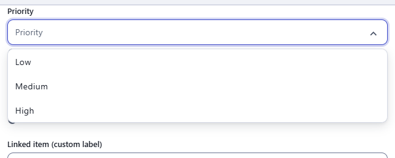 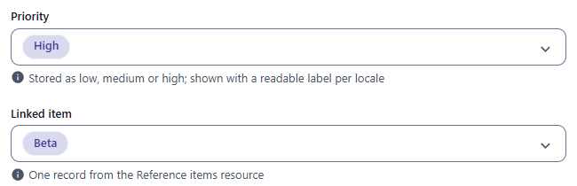

### Values from another resource

`resources/choice_select.js`, fields `item` and `itemWithLabel` (`customLabel: '{{name}}'`). The list shows the label and, under it, the id of each record. The value stored is the record `_id`.

```js
{ field: 'item', input: 'select', label: 'Linked item', localised: false, source: 'reference_items' }
```

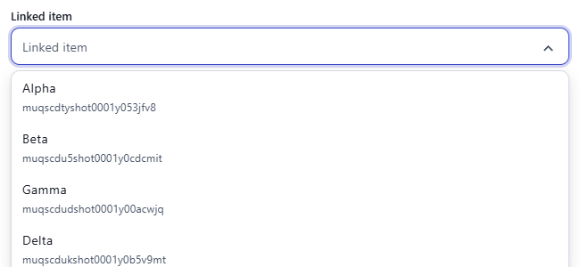 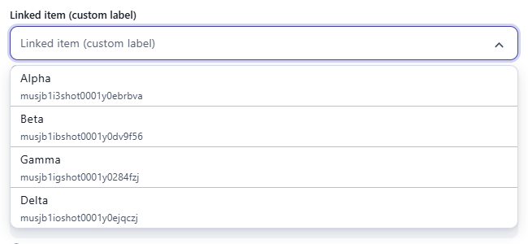 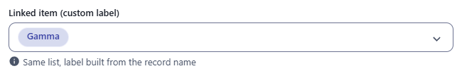

### Records of several resources

`resources/choice_select.js`, field `linked` (`sources: ['reference_items', { resource: 'reference_people', customLabel: '{{name}} ({{role}})', title: 'People' }]`).

```js
{ field: 'owner', input: 'select', label: 'Owner', localised: false, sources: ['authors', { resource: 'editors', customLabel: '{{name}} ({{role}})', title: 'Editors' }] }
```

The list shows the records of every resource under a heading for each (the title, in the order of `sources`), each by its label (while you search, the headings are left out and the kind of record is said under each record). An id alone does not say which resource it is of, so the value kept is a **reference**, `{ resource, id }`: `{ "owner": { "resource": "editors", "id": "mus3k2…" } }`. A reference to a record that is gone is shown by its id and marked as not found, so that it is not lost without being seen. In the table the record is shown by its label.

- API: `cms.api()('pages', 'authors', 'editors')` resolves the references of the resources it is asked for into the records, each with `_resource` (the resource it is of); a reference to a resource that was not asked for stays as it is, and one to a record that is gone becomes `undefined`.
- Import files, spreadsheets and sync name the record by its first `unique` field, as for a `source`: `{ "resource": "editors", "id": "Eve" }`. In a spreadsheet the cell holds the reference as JSON.
- Nothing checks that a reference is of a resource of `sources`.

### Localised

`resources/choice_select.js`, field `localisedChoice`: one choice per locale.

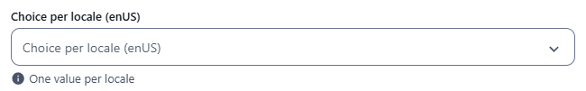

### Read-only

`resources/choice_select.js`, field `readOnlySelect`.

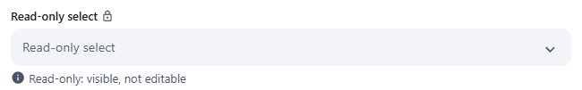

### Disabled

`resources/choice_select.js`, field `disabledSelect`.

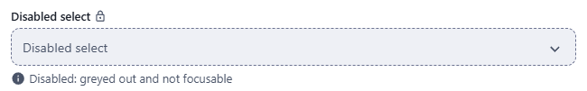

### Dark theme

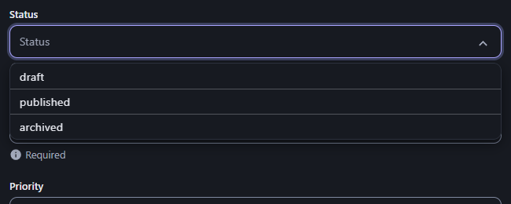

## Stored value

The chosen value: the string from `source`, the `_id` of the chosen record, or for `sources` the reference `{ resource, id }`. Localised: one value per locale.

```json
{
  "status": "published",
  "priority": "high",
  "item": "mumfqmi6dev00001yv1s8zhf",
  "localisedChoice": { "enUS": "two", "zhCN": "three" }
}
```

## Validation and behaviour

- UI: `required` only. Nothing checks that a value belongs to `source`.
- Server: only `unique`. REST accepts any value, including an id that does not exist.
- Import files (`lib/Resource.js`) can refer to the target record by its first `unique` field instead of its `_id`.
