← [Field types](../FIELDS.md) · [Documentation](../../README.md)

# string

Single line text input. Used for names, titles, codes, short labels. Component: `CustomInput` (`src/components/fields/CustomInput.vue`).

Catalogue: `resources/text_strings.js` (group **Text**, resource **Strings**).

## Declaration

```js
{ field: 'title', input: 'string', label: 'Title', required: true }
```

## Options

| Option | Type | Default | Description |
| --|---|---|---|
| `field` | string | required | Key of the value in the record. Dotted keys (`address.city`) are grouped in the form. |
| `input` | string | required | `'string'` |
| `label` | string \| `{ enUS, zhCN }` | `field` | Label above the input. A localised field shows the locale in brackets: `Name (enUS)`. |
| `required` | boolean | `false` | Adds `*` to the label and blocks Create/Save while empty. In a localised field every locale must be filled. |
| `unique` | boolean | `false` | Checked by the server (see below). |
| `localised` | boolean | `true` when the resource declares `locales` | `false` stores one value shared by every locale. |
| `options.hint` | string | none | Help text under the input (hidden while an error is shown). |
| `options.readonly` | boolean | `false` | Visible and copyable, not editable. Shows a lock icon after the label and skips validation. |
| `options.disabled` | boolean | `false` | Greyed out with a dashed border, not focusable. Skips validation. |
| `options.min` / `options.max` | number | none | Minimum / maximum **length** in characters. Errors: `The text is too short! Length: 2, minimum: 3` / `The text is too long! Length: 26, maximum: 12`. |
| `options.regex` | `{ value, description }` or `{ enUS: { value, description }, ... }` | none | Pattern written as `'/pattern/flags'` (a bare pattern also works). The per-locale form applies the rule of the locale being edited. Error: `Invalid format! (description)`. |
| `options.mask` | string | none | A template the box keeps while it is typed in, `(___) ___-____`: `_` or `#` is a digit, `A` a letter, `*` a letter or a digit, a backslash before a character takes it as it is, anything else is written for you. See [Mask](#mask). A template with no place is ignored. |

## Variations

### Default

Localised, optional. See `resources/text_strings.js`, fields `optional` (localised) and `sharedValue` (not localised).

```js
{ field: 'optional', input: 'string', label: 'Optional text' }
{ field: 'sharedValue', input: 'string', label: 'Shared text', localised: false }
```


### Localised versus shared

A localised field shows the current locale in the label and keeps one value per locale. Switch locale with the tabs at the top of the form.

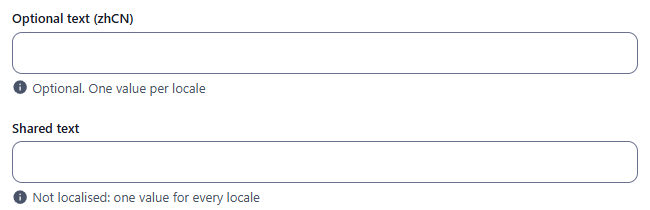

### Required

`resources/text_strings.js`, fields `name` (localised, required in every locale) and `uniqueCode`.

```js
{ field: 'name', input: 'string', label: { enUS: 'Name', zhCN: '名称' }, required: true }
```

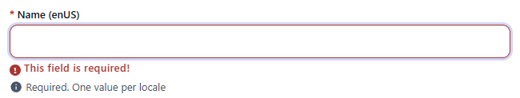

The locale tab that holds the error shows a red badge, and a toast names the locale (`1 required field missing in zhCN`).

### Unique

`resources/text_strings.js`, field `uniqueCode`. The check runs on the server when the record is created or updated.

```js
{ field: 'uniqueCode', input: 'string', localised: false, required: true, unique: true }
```

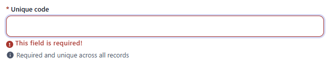

Saving a second record with the same value is refused:

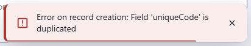

### Length limited

`resources/text_strings.js`, field `limited`. The length is checked when the field loses focus and when Create/Save is clicked.

```js
{ field: 'limited', input: 'string', localised: false, options: { min: 3, max: 12 } }
```

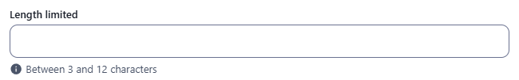 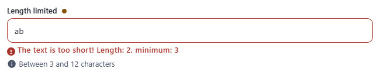 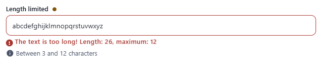

### Regex

`resources/text_strings.js`, fields `pattern` (one rule) and `patternPerLocale` (one rule per locale).

```js
options: { regex: { value: '/^[A-Z]{3}\\d{3}$/', description: 'Format: AAA123' } }
options: { regex: { enUS: { value: '/^[a-z ]+$/', description: 'Lowercase letters only' },
                    zhCN: { value: '/^[\\u4e00-\\u9fa5]+$/', description: 'Chinese characters only' } } }
```

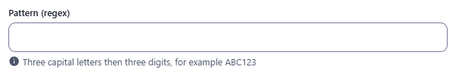 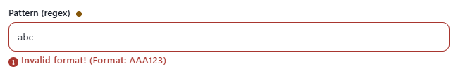

With one rule per locale, each locale tab applies its own rule:

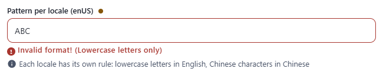 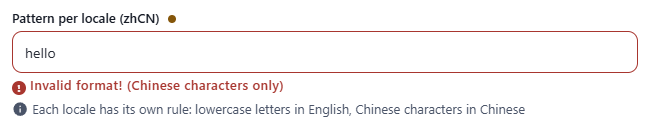

### Mask

`resources/text_strings.js`, fields `maskPhone`, `maskDate`, `maskPlate`, `maskFlight`, `maskCode` and `maskLocalised`.

```js
{ field: 'phone', input: 'string', label: 'Phone', localised: false, options: { mask: '(___) ___-____' } }
{ field: 'plate', input: 'string', label: 'Plate', localised: false, options: { mask: 'AA-___-AA' } }
```

With `options.mask` the box keeps its template while it is typed in, with an underscore for each place left: `(___) ___-____`. The characters fill the places from the left, the characters of the template are written for you, and what does not fit a place is not taken. The template says what each character is:

| In the template | Takes |
|---|---|
| `_` or `#` | a digit |
| `A` | a letter, of any language |
| `*` | a letter or a digit |
| `\` before a character | that character as it is, a place included (`\A`, `\_`, `\#`, `\*`, `\\`) |
| anything else | itself: it is written in the box, and is not typed |

- Text in the template that is not one of those four characters is written for you and cannot be typed: `F__-AAAA` (field `maskFlight`) shows `F__-____`, takes two digits and then four letters, and gives `F12-abcd`. A backslash is only needed for a character that is itself a place: `\A__-AAAA` writes a capital A first.
- Backspace takes the last character away. When the box is entered its whole text is selected, so that what you type replaces it. The caret always goes to the next place, wherever the box is clicked.
- A text pasted in any way of writing it fills the places: `555-123-4567`, `5551234567` and `(555) 123-4567` all give `(555) 123-4567`; what does not fit is left out.
- The value kept is the text as the template writes it, as far as it goes: `(555) 123-4567`. A box with no character holds nothing. A text that is not complete is refused when the box is left, with `Fill in every place: (___) ___-____`; `required`, `min`, `max` and `regex` apply to the value as kept.
- A template with no place (`'abc'`) is ignored: the field is the usual text box. Only a `string` takes a mask; the same template is how the [duration](duration.md) field is given its own shape (`options.template`).

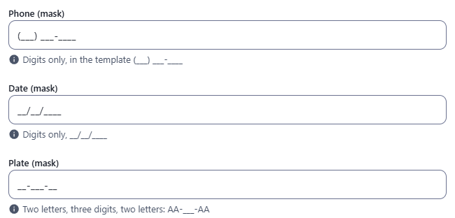 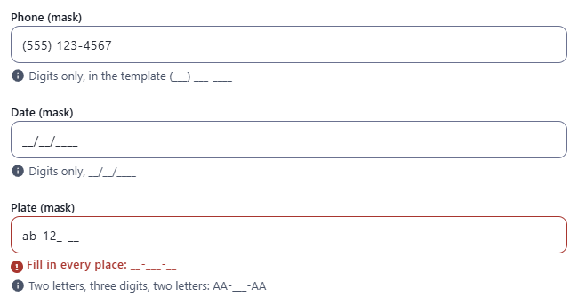

### Read-only

`resources/text_strings.js`, field `readOnly`.

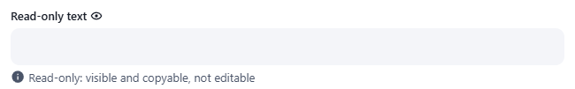

### Disabled

`resources/text_strings.js`, field `disabled`.

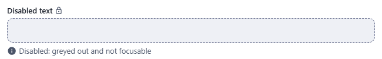

### Dark theme

The same fields in the dark theme (available when `disableDarkMode` is `false` in the CMS config; it is `true` by default).

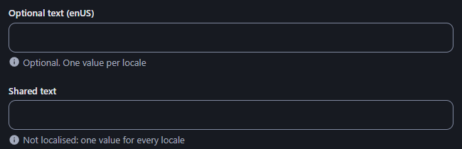 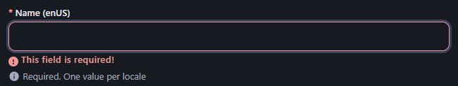

## Stored value

A string, or one string per locale for a localised field:

```json
{
  "name": { "enUS": "Hello World", "zhCN": "你好" },
  "uniqueCode": "A1",
  "limited": "abcde"
}
```

- A localised field that was not touched in the admin is saved as `{}`; a non-localised field left empty is omitted, and one that was emptied after typing is saved as `""`.
- Records created over REST with `?locale=enUS` are stored locale-first (`{ "enUS": { "name": "Loc" } }`), which the admin does not read as `name.enUS`. Send the field-first shape shown above.

## Validation and behaviour

UI (`src/utils/fieldValidation.js`), shown under the field when it loses focus and again when Create/Save is clicked, which is blocked while a field is invalid:
- `required`: empty (`''`, `null`, `undefined`) shows `This field is required!`. Every locale must be filled, otherwise the save is blocked, the locale tab is marked and a toast names the locale.
- `min` / `max` (length) and `regex`, in that order.
- An **empty optional value is always valid**; rules only apply to a value that was typed.
- Read-only and disabled fields are never validated.

Server (`lib/helpers.js`, `checkUniqueFields`, `lib/Resource.js`):
- Only `unique` is enforced: a duplicate answers `400 { code: 400, message: "Field 'uniqueCode' is duplicated" }`.
- `required`, `min`, `max` and `regex` are not checked on the server: a REST client can save any value (`pattern: "bad"` and a 1-character `limited` were stored over REST).
- On a localised field uniqueness is checked per locale: two records with `name.enUS = "Same"` are refused even if their `zhCN` values differ (`Field 'name.enUS' is duplicated`).
