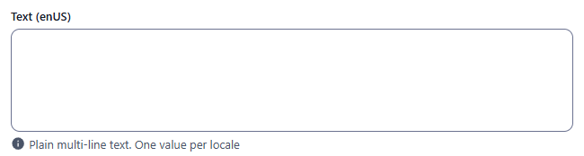
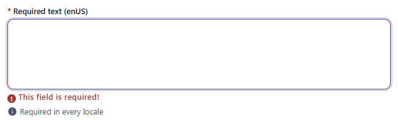
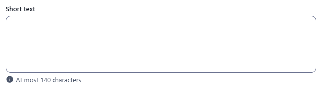
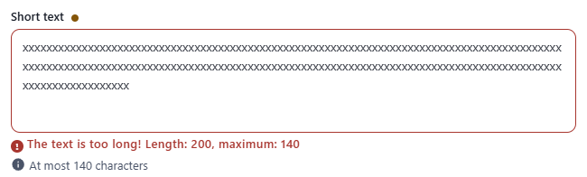
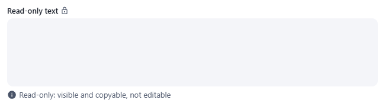
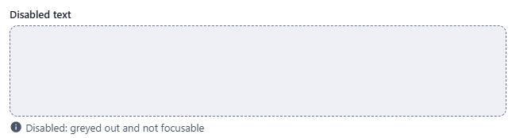

← [Field types](../FIELDS.md) · [Documentation](../../README.md)

# text

Multi-line plain text (a textarea that grows with its content). Component: `CustomTextarea` (`src/components/fields/CustomTextarea.vue`).

Catalogue: `resources/text_long.js` (group **Text**, resource **Long text**).

## Declaration

```js
{ field: 'summary', input: 'text', label: 'Summary' }
```

## Options

| Option | Type | Default | Description |
|---|---|---|---|
| `field`, `input`, `label`, `unique`, `localised` | | | As for [string](string.md). |
| `required` | boolean | `false` | Empty text shows `This field is required!`. In a localised field every locale must be filled. |
| `options.hint` | string | none | Help text under the field. |
| `options.readonly` | boolean | `false` | Not editable, a lock icon after the label, no validation. |
| `options.disabled` | boolean | `false` | Greyed out with a dashed border, not focusable. |
| `options.min` / `options.max` | number | none | Minimum / maximum length in characters (`The text is too short! ...` / `The text is too long! Length: 200, maximum: 140`). |
| `options.regex` | object | none | Same format as [string](string.md#regex): `Invalid format! (description)`. |

## Variations

### Default

`resources/text_long.js`, field `text` (localised).

```js
{ field: 'text', input: 'text', label: 'Text' }
```



### Required

`resources/text_long.js`, field `requiredText` (required in every locale).



### Length limited

`resources/text_long.js`, field `limitedText` (`options: { max: 140 }`). Checked on blur and on Create/Save.

 

### Read-only

`resources/text_long.js`, field `readOnlyText`.



### Disabled

`resources/text_long.js`, field `disabledText`.



## Stored value

```json
{ "requiredText": { "enUS": "req en", "zhCN": "req zh" }, "limitedText": "a shared value" }
```

A localised field never edited is saved as `{}`; a non-localised field left empty is omitted. Line breaks are stored as `\n`.

## Validation and behaviour

- UI: `required`, then `min` / `max` and `regex`, on blur and on Create/Save (the save is blocked while a field is invalid). An empty optional value is always valid. Rules as for [string](string.md#validation-and-behaviour).
- Server: only `unique` is enforced; `required`, `min`, `max` and `regex` are not checked over REST either.
