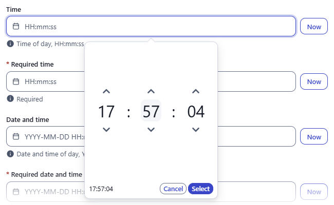
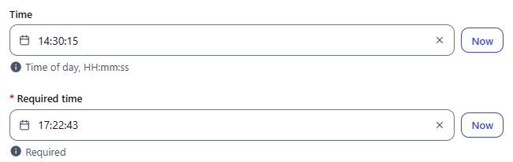
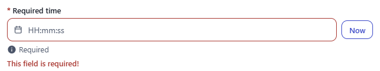

← [Field types](../FIELDS.md) · [Documentation](../../README.md)

# time

Time-of-day picker (hours, minutes, seconds) with a **Now** button. Component: `CustomDatetimePicker`, like [date](date.md) and [datetime](datetime.md).

Catalogue: `resources/dates.js`, fields `time` and `requiredTime`.

## Declaration

```js
{ field: 'opensAt', input: 'time', label: 'Opens at', localised: false }
```

## Options

Same as [date](date.md), with these defaults:

| Option | Type | Default | Description |
|---|---|---|---|
| `options.format` | string | `'HH:mm:ss'` | Display and typing format (dayjs tokens); minutes and seconds spinners follow the tokens `mm` and `ss`. |
| `options.customDatetimePickerOptions.placeholder` | string | `'HH:mm:ss'` | Placeholder text. |
| `options.readonly`, `options.disabled` | boolean | `false` | As for [date](date.md); the Now button is hidden when locked. |

## Variations

### Default and required

`resources/dates.js`, fields `time` and `requiredTime`.


The popup shows three spinners; **Now** fills the current time.

 

### Required error

Same as [date](date.md#required-error): the save is refused, the field is outlined in red with `This field is required!`.



## Stored value

A timestamp in milliseconds. Only the time of day is meaningful; the date part is **today's date** in the browser's time zone at the moment of the edit:

```json
{ "time": 1790663415000 }
```

`1790663415000` is 2026-09-29 14:30:15 in UTC+8. Read the hours, minutes and seconds in the same time zone the editor used.

## Validation and behaviour

- UI: the required check only.
- The default format is the 24-hour `HH:mm:ss`: 16:48:51 is displayed as `16:48:51`.
- Server: only `unique`.
