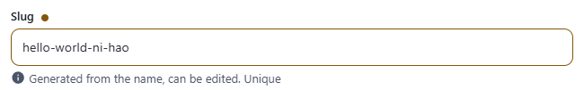
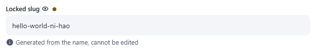

← [Field types](../FIELDS.md) · [Documentation](../../README.md)

# transliterate

Single-line text generated from another field of the same record (a slug). Component: `Transliterate` (`src/components/fields/Transliterate.vue`).

Catalogue: `resources/text_strings.js`, fields `slug` and `lockedSlug`.

## Declaration

```js
{ field: 'slug', input: 'transliterate', label: 'Slug', localised: false, unique: true, options: { valueFrom: 'name', readonly: false } }
```

## Options

| Option | Type | Default | Description |
|---|---|---|---|
| `field`, `input`, `label`, `localised`, `unique` | | | As for [string](string.md). |
| `required` | boolean | `false` | Only marks the label with `*`; the component runs no required check itself. |
| `options.valueFrom` | string | none (warns once in the console, stays empty) | Key of the source field. A localised source works: a localised slug uses the source value of **its own locale**, a shared (`localised: false`) slug uses the resource's **first locale**, so switching the editing language does not change a shared slug. |
| `options.readonly` | boolean | **`true`** | `true`: the value always follows the source and cannot be edited. `false`: it follows the source until the editor types in it. |
| `options.disabled` | boolean | `false` | Greyed out, not focusable. |
| `options.hint` | string | none | Help text under the input. |

The value is `slugify(source, { lowercase: true, separator: '-' })` from the `transliteration` package: `Hello World` becomes `hello-world`, accented and Chinese characters are transliterated to pinyin (`你好` gives `ni-hao`).

## Variations

### Editable slug

`resources/text_strings.js`, field `slug` (`readonly: false`). The slug is regenerated while the editor has not touched it, or while it is empty. Once edited by hand it stays as typed; emptying it makes it follow the source again. `unique: true` is enforced by the server, as for a string.

In the catalogue the slug of `Héllo Wörld 你好!` is `hello-world-ni-hao`; editing the zhCN name did not change it.



### Locked slug

`resources/text_strings.js`, field `lockedSlug` (`readonly: true`, also the default when `readonly` is omitted). The input is not editable and always follows the source. Unlike `string`, no lock icon is shown.



## Stored value

A string (a `{ enUS, zhCN }` object when `localised` is not `false`):

```json
{ "slug": "hello-world" }
```

## Validation and behaviour

- The slug is computed in the browser only; the server stores whatever it receives and only checks `unique`.
- Clearing the source clears the slug (unless the editor has edited an editable slug).
- With `valueFrom: 'name'` and a localised source, `slug` and `lockedSlug` follow the enUS name; typing a slug by hand keeps it while the name changes, and emptying it makes it follow the name again.
