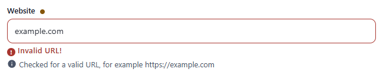
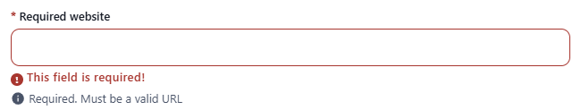
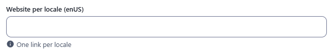
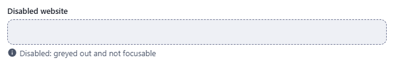
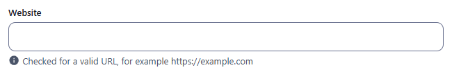

← [Field types](../FIELDS.md) · [Documentation](../../README.md)

# url

Single-line input checked for a valid absolute URL. Component: `CustomInput` (text type).

Catalogue: `resources/text_formats.js`, fields `url`, `requiredUrl`, `localisedUrl`, `disabledUrl`.

## Declaration

```js
{ field: 'url', input: 'url', label: 'Website', localised: false }
```

## Options

| Option | Type | Default | Description |
|---|---|---|---|
| `field`, `input`, `label`, `required`, `localised`, `unique` | | | As for [string](string.md). |
| `options.hint` | string | none | Help text under the input. |
| `options.readonly` | boolean | `false` | Not editable, a lock icon after the label, no validation. |
| `options.disabled` | boolean | `false` | Greyed out, not focusable. |
| `options.min` / `options.max`, `options.regex` | | none | Length and pattern rules, as for [string](string.md); they run before the URL check. |

## Variations

### Default

`resources/text_formats.js`, field `url`.


A value is valid when `new URL(value)` accepts it, so a scheme is needed: `example.com` is refused with `Invalid URL!`, `https://example.com` is accepted. An empty optional field is valid.



### Required

`resources/text_formats.js`, field `requiredUrl`.



### Localised

`resources/text_formats.js`, field `localisedUrl` (one link per locale).



### Disabled

`resources/text_formats.js`, field `disabledUrl`. It is not validated and does not block the form.



## Stored value

```json
{ "url": "https://example.com", "localisedUrl": { "enUS": "https://a.io", "zhCN": "https://b.io" } }
```

## Validation and behaviour

- UI: `required` first, then length / `regex` rules, then the URL check, on blur and on Create/Save. An **empty optional value is valid**, so an optional `url` field does not block the form, and neither does a disabled one; a field emptied after typing is saved as `""`.
- Server: only `unique`. `"nope"` sent over REST is stored.

All the records of the catalogue resource `text_formats` can be created from the admin.


