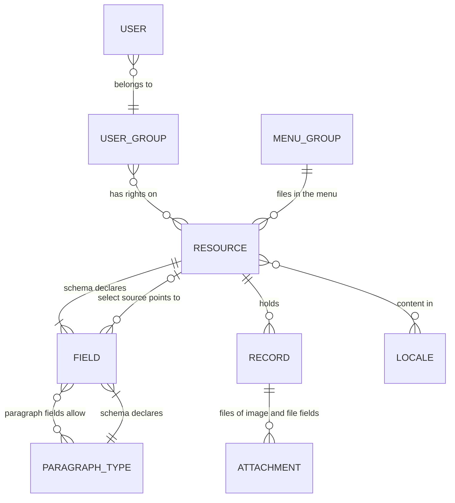

← [Documentation](../README.md)

# Concepts

embed-cms has a small vocabulary. Once these few words click, everything else in the documentation reads easily. Each section says what the thing is, why it's there, and where to read more.

Here's how the main ideas fit together. Every box is explained below.



## Resource

A resource is a kind of content: articles, authors, products, your site settings. You declare it with one JavaScript file in `resources/`, and the file name is its name. `resources/articles.js` declares `articles`, served at `/api/articles` and listed in the admin's menu.

```js
// resources/articles.js
module.exports = {
  displayname: { enUS: 'Articles', zhCN: '文章' },  // the name in the menu
  group: 'Content',                                  // the heading it is filed under
  locales: ['enUS', 'zhCN'],                         // content languages, see Locale
  schema: [ /* fields */ ]
}
```

Every resource keeps its records apart from the others: its own LevelDB folder (or file, table or collection) and its own folder of files. A record is one item of a resource, say one article, and the CMS gives it an `_id`.

The keys a declaration can have (the full list, with examples, is in [Resource files](../reference/RESOURCES.md)):

| Key | What it does |
|---|---|
| `schema` | The [fields](#field). |
| `displayname` | The name shown in the admin: a string, or one per admin language. |
| `group` | The [menu group](#group) it's listed under: a name, or a list of names to nest it, like `['Content', 'Blog']`. |
| `locales` | The [content languages](#locale). |
| `view` | `'table'` for a spreadsheet-like [view](#view) instead of the list. |
| `maxCount` | The most records it may hold. With `1` it's a single record (site settings, a home page): the admin opens it directly, with no list. Once the limit is reached, a create returns the existing record instead of failing. |
| `type` | `normal`, `downstream` or `upstream`: the direction of [replication](../operations/REPLICATION.md#directions). |
| `groups` | How groups of nested fields look, keyed by path: `groups: { address: { label: 'Address', collapsible: true } }` (title, `collapsible`, `collapsed`, `layout`: see [Groups](../reference/FIELDS.md#groups)). |
| `allowed` | User groups that see the resource in the admin's menu. The API doesn't enforce it: use group rights for that. |
| `layout` | A form layout in lines and widths for the editor. |
| `displayItem` | A Mustache template that names a record in lists, like `'{{title}} ({{status}})'`. Without it, a record is named by its first field. |
| `extraSources` | `{ field: resource }`: turns the id in a field into the record it points to, so `displayItem` can use its fields. |
| `activeField` | A boolean field of which at most one record may be `true` (say, the current campaign). |

## Field

A field is one entry of the `schema`: a value of the record, plus the control that edits it.

```js
{ field: 'price', input: 'number', label: 'Price', required: true, options: { min: 0, hint: 'In euros' } }
```

`field` is the key in the record and `input` is the type of control. There are 24 of them: text, numbers, dates, choices, images, files, rich text, blocks and more. The type decides what gets stored and how the admin checks it. A dotted key such as `address.city` nests the value and groups the fields in the form.

The admin checks `required`, formats, lengths and patterns before it saves. The server only checks `unique`, so anything that writes over the API is trusted to send valid data. [FIELDS.md](../reference/FIELDS.md) has every type, with screenshots.

## Locale

"Language" means two different things in embed-cms, and it helps to keep them apart:

- **Content locales** are the languages your content is written in. A resource lists them in `locales`, and every field then holds one value per locale, `{ "title": { "enUS": "Hello", "zhCN": "你好" } }`, unless it says `localised: false`. The editor has a tab per locale, and a required field must be filled in each one.
- **Admin languages** are the languages of the admin app itself: English (`enUS`) and Chinese (`zhCN`), from the files in `i18n/`. You can give labels and hints per admin language: `label: { enUS: 'Price', zhCN: '价格' }`.

A resource can have content locales the admin isn't translated into, and the other way round.

## Attachment

An attachment is a file that belongs to a record: an image in an `image` field, a PDF in a `file` field. The record keeps a description of each file (name, type, size and MD5). The file itself is written to disk next to the resource's data, or to Alibaba Cloud OSS for fields set up for it. Whatever the storage engine, files are never inside the database.

The API returns attachments grouped under their field, each with a `url`. You can ask for an image resized or cropped (`?resize=400x300`), and the resized copies are cached.

## Paragraph

A paragraph field holds a list of blocks that the editor adds, reorders and removes: a text block, then a quote, then a gallery. Each block has a type, and you declare each type like a small resource, in `resources/paragraphs/`:

```js
// resources/paragraphs/quote.js
module.exports = {
  displayname: 'Quote',
  schema: [
    { field: 'text', input: 'text', label: 'Quote' },
    { field: 'author', input: 'string', label: 'Author' }
  ]
}
```

A field `{ field: 'body', input: 'paragraph', options: { types: ['quote', 'text'] } }` then lets editors build a page out of those blocks. Blocks can nest. See [the paragraph field](../reference/fields/paragraph.md) and, for blocks side by side, [dynamic layout](../reference/DYNAMIC_LAYOUT.md).

## Users, groups and rights

Everyone who logs in is a **user**, and every user belongs to one **group**. Rights belong to groups, per resource:

| Right | Allows |
|---|---|
| `read` | Reading records (`GET`). |
| `create` | Creating records (`POST`). |
| `update` | Changing records (`PUT`). |
| `remove` | Deleting records (`DELETE`). |
| `attachments` | Adding, changing and removing files. |
| `plugins` | Seeing admin pages by name, such as `Syslog`. |

Users and groups are ordinary resources (`_users`, `_groups`), edited in the admin's **CMS** menu. A user also carries two preferences for their own admin: a **Theme** (light or dark, when [dark mode](../reference/CONFIG.md#features-you-can-switch) is on) and a **Language** (one of the [admin's languages](../reference/CONFIG.md#features-you-can-switch)). Both apply when they log in, and at once when they save their own user.

Two groups always exist. **`admins`** is given every right on every resource at each start. **`anonymous`** is the group of requests without a login, and it has no rights until you give it some, for example with [`anonymousRead`](../reference/CONFIG.md#features-you-can-switch) (unless both [login switches](../reference/CONFIG.md#authentication) are on, which opens everything to it). How people log in, with a browser prompt or a login page, is set in [CONFIG.md](../reference/CONFIG.md#authentication).

## Group

The word does triple duty:

- a **user group**, as above;
- a **menu group**, the `group` of a resource: the heading it's filed under in the admin. Give a list of names to nest it, from the top down: `group: ['Content', 'Blog']` files the resource under Blog, which sits inside Content. The list can be any length. Each name is a string or one string per language, and a plain string is a single level. Every group can get an icon in **Settings**; a group inside another is named like `Content / Blog` there. The collapsed menu shows a badge for the top group only, and its pop-up lists the groups inside;
- a **field group**, the heading the form draws over nested fields (`address.city`, `address.zip`).

## View

A view is how the admin shows the records of a resource:

- the **list** (the default): a column of records on the left, the editor on the right;
- the **table** (`view: 'table'`): a grid with a column per field, sorting, column choice and bulk delete, for resources with lots of short records;
- the **single record** (`maxCount: 1`): no list, the editor straight away.

## Plugin

A plugin is a feature you can switch on or off: the REST API, the admin, replication, sync, import, the Excel export. Each one lives in `lib/plugins/`, is turned on by an option in [CONFIG.md](../reference/CONFIG.md#features-you-can-switch), and mounts its own routes. In code, `cms.use(Plugin, options)` installs one.

The admin has plugin **pages** too: Syslog, Replicator, Cms Import, Sync. A project can add its own Vue pages in `embed-cms/plugins/`, and the admin build picks them up.

## System resources

Resources whose name starts with an underscore belong to the CMS itself: `_users`, `_groups`, `_settings` (logo, title, top-bar links and menu icons), and `_sync` and `_xlsx` when their plugins are on. You edit them in the admin like any other resource, and they aren't broadcast over the update websocket.
